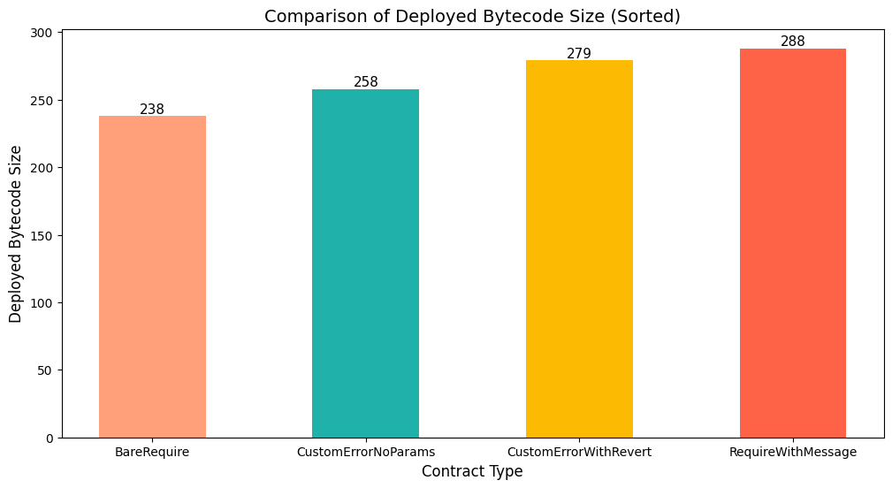

# Solidity Error-Handling Benchmarking

This repository provides a benchmark comparison of various error-handling techniques in Solidity smart contracts. The focus is on evaluating gas efficiency across methods in a controlled, simulated environment using Foundry Anvil. This benchmarking project aims to offer insights into the cost-effectiveness of each error-handling approach, helping developers make informed decisions in smart contract development.

## Table of Contents
- [Overview](#overview)
- [Techniques Compared](#techniques-compared)
- [Getting Started](#getting-started)
  - [Prerequisites](#prerequisites)
  - [Installation](#installation)
- [Running Tests](#running-tests)
- [Results](#results)
- [Visualizations](#visualizations)
- [Caveats](#caveats)
- [Recommendations](#recommendations)
- [Video Demo](#video-demo)
- [License](#license)

## Overview
The purpose of this project is to benchmark five different error-handling techniques in Solidity to understand their relative gas efficiency. The tests were conducted in a simulated Foundry Anvil environment, where each method's performance was measured based on gas usage.

## Techniques Compared
The following techniques were benchmarked:
1. **Bare `require` Statement**: Basic error check with no additional information.
2. **Require with Error Message**: Standard `require` with a message that is returned on failure.
3. **Custom Error with Parameters**: Custom error that provides contextual information on failure.
4. **Custom Error without Parameters**: Custom error with no additional parameters.


## Getting Started

### Prerequisites
Ensure you have Foundry installed. You can install Foundry by running:
```bash
curl -L https://foundry.paradigm.xyz | bash
foundryup
```

### Installation
Clone the repository and install dependencies.
```bash
git clone https://github.com/mosesmrima/solidity-error-handling-gas-benchmark
cd solidity-error-handling-gas-benchmark
forge install
```

## Running Tests
To execute the benchmark tests and view gas usage, run:
```bash
forge test --gas-report
```

## Results
The results from these tests provide a relative comparison of gas efficiency across the error-handling methods.



## Visualizations

For a detailed breakdown and visualizations of the benchmarking data, refer to the [visualization notebook](./benchmark_visualizations.ipynb).

## Caveats
These benchmarking tests are conducted in a simulated Foundry Anvil environment, which doesn’t account for real-world gas price variations across different blockchain networks. The results provide relative comparisons in a controlled environment but may differ slightly on actual chains with dynamic pricing models.

## Recommendations
For optimal gas efficiency, developers should consider the trade-offs of each error-handling technique. In general, custom errors without parameters tend to be the most gas-efficient for cases where additional context is not needed.

**For Efficiency:**  
- `Custom errors with no parameters` for simple checks: When you need to handle errors efficiently, custom errors with no parameters are a great option since you can get descriptive with the custom error name.

- `require` with no message: This method is the most gas-efficient when performing simple checks. It doesn’t involve any extra data, such as a custom error message, reducing both gas and bytecode size. How ever this is discourage since it doesn't prvide any context on the error therefore not recomended on production codebases.

**For Debugging:**  
- `Custom errors with parameters` for more context: For more complex scenarios or when you need additional context during debugging, custom errors with parameters are an excellent choice. They provide relevant details, which can help with troubleshooting and understanding failure conditions.

**Avoid:**  
- `require with custom message strings`: Although helpful for debugging, `require` with custom message strings is less efficient due to the additional gas cost required to store and handle the message strings. These should be avoided in favor of custom errors or simple `require` statements when efficiency is a priority.


## Video Demo 
[Demo](https://www.loom.com/share/64cdfb7f364446aebae44e5d01633afe?sid=b056719e-5dbb-4ab1-b0b7-518973b4e11c)
## License
This project is licensed under the MIT License - see the [LICENSE](LICENSE) file for details.